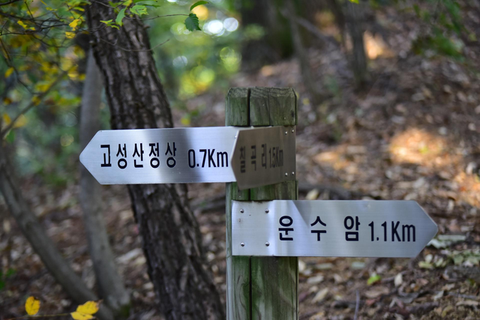

# Lomin Scene Text Dataset

### 데이터셋 소개

Lomin Scene Text Dataset 데이터셋은 실생활에서 자주 볼 수 있는 다양한 환경의 글자들을 활용한 OCR 데이터셋입니다.
이미지는 주로 야외의 간판, 표지판과 같이 기존 OCR 기술로 인식하기 어려웠던 높은 자유도의 글자들을 포함하고 있습니다.
라벨링은 Scene text detection과 recognition 연구에 활용될 수 있도록 bounding box와 transcription 정보를 가지고 있습니다.
이 데이터셋은 2019년 과기정통부에서 주최한 그랜드 AI 챌린지에서 우승한 Lomin 팀이 IITP 후속과제의 지원을 받아 생성되었습니다.


### 다운로드

전체 데이터셋은 다음 링크를 통하여 다운받을 수 있습니다. [link](lomin.ai) 

(문의: 임비 선임연구원 b.lim@lomin.ai)


### 데이터셋 구조

```
lomin_scene_text_dataset/
├── images
├── gt.json
├── LICENSE
└── README.md
```


### 샘플 이미지



### 라이센스
본 데이터셋은 [GPLv3](https://www.gnu.org/licenses/gpl-3.0.en.html) 라이센스를 따릅니다.